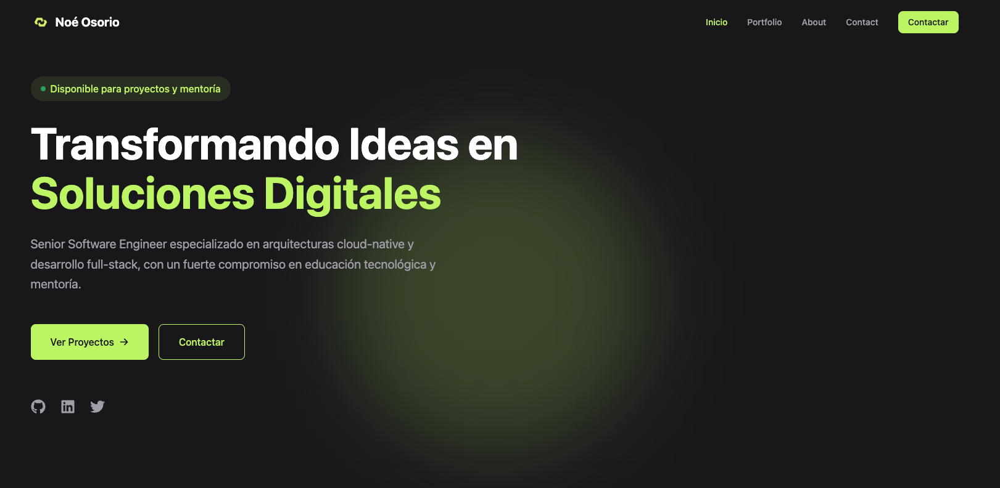
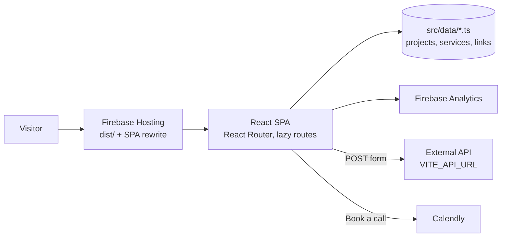

<div align="center">

<!-- TODO: create docs/banner-dark.png and docs/banner-light.png (1280x640) with the noeosorio.com palette (background #18181b, accent #bef264 → #10b981) and uncomment
<picture>
  <source media="(prefers-color-scheme: dark)" srcset="docs/banner-dark.png">
  
</picture>
-->


# noeosorio.com

**The personal site of Noé Osorio: portfolio, software services and tech education in one place, built to turn visitors into conversations.**

[](https://noeosorio.com)


[Visit the site](https://noeosorio.com) · [Report a bug](https://github.com/NoeOsorio/noeosorio-landing/issues)

</div>

Source code of [noeosorio.com](https://noeosorio.com), the Spanish-language landing page where Noé Osorio (Senior Software Engineer and tech educator) shows his work, explains the services he offers and lets people book a call. It is a single-page React app served from Firebase Hosting, with page content kept in plain TypeScript data files so it can be updated without touching the components.

<div align="center">

[Features](#-features) · [Demo](#-demo) · [Quickstart](#-quickstart) · [Configuration](#%EF%B8%8F-configuration) · [Architecture](#%EF%B8%8F-architecture) · [Structure](#-structure) · [License](#-license)

</div>

## ✨ Features

| | Feature | Where it lives |
|---|---|---|
| 🏠 | **Home** with hero, featured projects, services showcase, industries, education preview and CTA | `src/pages/Home.tsx`, `src/sections/home/` |
| 💼 | **Portfolio** with a detail page per project (`/portfolio/:projectId`) | `src/pages/Portfolio.tsx`, `src/data/projects.ts` |
| 🛠️ | **Services** catalog with dedicated pages, FAQ, process and use cases | `src/pages/Services.tsx`, `src/pages/services/`, `src/data/services.ts` |
| 📅 | **Contact and booking** through Calendly, email and social links | `src/pages/Contact.tsx`, `src/pages/Social.tsx` |
| 📝 | **Lead form** validated with React Hook Form + Zod, posted to an external API | `src/components/LeadForm.tsx`, `src/services/api.ts` |
| 📊 | **Analytics** page views and events via Firebase Analytics, behind a cookie banner | `src/hooks/useAnalytics.ts`, `src/components/CookieConsent.tsx` |
| 🔎 | **SEO** per-page meta tags, Open Graph image, `sitemap.xml` and `robots.txt` | `src/components/SEO.tsx`, `public/` |
| ⚡ | **Lazy-loaded routes** with a loading screen and long-lived cache headers for assets | `src/App.tsx`, `firebase.json` |

## 🖼️ Demo

<div align="center">
  <a href="https://noeosorio.com"></a>
</div>

## 🚀 Quickstart

**Prerequisites**

- Node.js 18+ (required by Vite 6) and npm
- [Firebase CLI](https://firebase.google.com/docs/cli), only to deploy

**Run locally**

```bash
git clone https://github.com/NoeOsorio/noeosorio-landing.git
cd noeosorio-landing
npm install
cp .env.example .env   # fill in the values (see Configuration)
npm run dev
```

Vite serves the site at `http://localhost:5173`.

| Command | What it does |
|---|---|
| `npm run dev` | Development server with HMR |
| `npm run build` | Type-check (`tsc`) and build to `dist/` |
| `npm run preview` | Serve the production build locally |
| `npm run lint` | Run ESLint |
| `npm run deploy` | Build and publish to Firebase Hosting (`firebase deploy`) |

## ⚙️ Configuration

All variables are read by Vite at build time from `.env` (see [`.env.example`](.env.example)).

> [!WARNING]
> Every `VITE_*` variable is embedded in the public JavaScript bundle. Only put values here that are safe to expose (Firebase web config is designed to be public); never server secrets.

| Variable | Purpose |
|---|---|
| `VITE_FIREBASE_API_KEY` | Firebase web app API key |
| `VITE_FIREBASE_AUTH_DOMAIN` | Firebase auth domain |
| `VITE_FIREBASE_PROJECT_ID` | Firebase project ID |
| `VITE_FIREBASE_STORAGE_BUCKET` | Firebase storage bucket |
| `VITE_FIREBASE_MESSAGING_SENDER_ID` | Firebase messaging sender ID |
| `VITE_FIREBASE_APP_ID` | Firebase app ID |
| `VITE_FIREBASE_MEASUREMENT_ID` | Google Analytics measurement ID used by Firebase Analytics |
| `VITE_API_URL` | Base URL of the backend that receives contact and lead form submissions |

Without `VITE_API_URL` the forms cannot be submitted.

## 🏗️ Architecture


```mermaid
flowchart LR
    V[Visitor] --> H[Firebase Hosting<br/>dist/ + SPA rewrite]
    H --> APP[React SPA<br/>React Router, lazy routes]
    APP --> DATA[(src/data/*.ts<br/>projects, services, links)]
    APP --> FA[Firebase Analytics]
    APP -- "POST form" --> API[External API<br/>VITE_API_URL]
    APP -- "Book a call" --> CAL[Calendly]
```

Content (projects, services, footer links) lives in `src/data/`: to change what the site says, edit those files rather than the components.

## 📁 Structure

<details>
<summary>View structure</summary>

```text
.
├── email-templates/     # HTML emails for lead confirmation and admin notification
├── public/              # Static assets: logo, OG image, favicons, sitemap, robots
├── src/
│   ├── components/      # Layout, Navbar, Footer, SEO, CookieConsent, LeadForm...
│   │   └── services/    # Service cards, bundles, financing
│   ├── config/          # Firebase initialization
│   ├── data/            # Editable content: projects, services, footer links
│   ├── hooks/           # Analytics, document meta, toasts
│   ├── pages/           # Route pages (Home, About, Services, Portfolio, Contact...)
│   ├── sections/        # Page sections for home and services
│   ├── services/        # API client for form submissions
│   ├── types/           # Shared TypeScript types
│   └── App.tsx          # Router and lazy-loaded routes
├── firebase.json        # Hosting config: SPA rewrite and cache headers
└── vite.config.ts       # Vite + React + Tailwind CSS v4
```

</details>

<details>
<summary>Editing content</summary>

- **Projects:** `src/data/projects.ts`. Each project has an `id` (used in `/portfolio/:projectId`), title, description, role, company, technologies, images and key points.
- **Services:** `src/data/services.ts`. Each entry in `mainServices` has an `id` that must match its route (for example `web-app` → `/services/web-app`), plus icon, description, use cases and features.
- **Icons:** import from `react-icons` (for example `HiCode` from `react-icons/hi`).
- **Images:** prefer WebP and optimize before adding them to `public/`.

</details>

## 📄 License

Distributed under the MIT License. See [`LICENSE`](LICENSE).

---

<div align="center">

Made with ☕ by [Noé Osorio](https://noeosorio.com) · [business@noeosorio.com](mailto:business@noeosorio.com)

</div>
