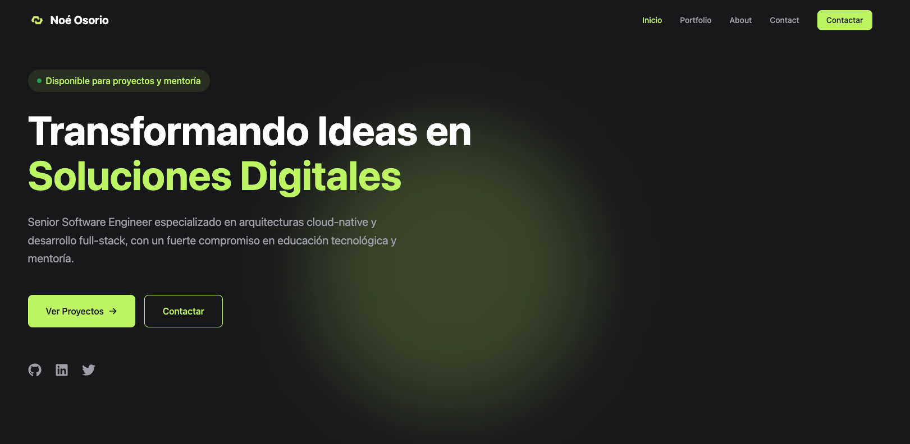

<div align="center">
  

  # Noé Osorio - Portfolio Website
  
  <p align="center">
    <strong>Senior Software Engineer & Tech Educator</strong>
  </p>

  <p align="center">
    <a href="https://noeosorio.com">View Demo</a>
    ·
    <a href="https://github.com/NoeOsorio/portfolio/issues">Report Bug</a>
    ·
    <a href="https://github.com/NoeOsorio/portfolio/issues">Request Feature</a>
  </p>

  <div align="center">
    
    
    
    
  </div>

  <br />

  
</div>

<br />

## 🚀 Features

- **Modern Design**: Clean and minimalist interface with smooth animations
- **Responsive Layout**: Fully responsive design that works on all devices
- **Dark Theme**: Eye-friendly dark mode with lime accents
- **Performance Optimized**: Fast loading times and smooth transitions
- **SEO Ready**: Optimized meta tags and semantic HTML
- **Type Safe**: Built with TypeScript for better code quality
- **Accessible**: WCAG compliant and keyboard navigable

## 🛠️ Tech Stack

- **Frontend Framework**: React 18
- **Type System**: TypeScript
- **Styling**: Tailwind CSS
- **Routing**: React Router v6
- **Icons**: React Icons
- **Build Tool**: Vite
- **Deployment**: Cloudflare Pages

## 🏗️ Project Structure

```
src/
├── components/        # Reusable UI components
│   ├── Layout.tsx    # Main layout wrapper
│   ├── Navbar.tsx    # Navigation component
│   ├── Logo.tsx      # Logo component
│   └── Footer.tsx    # Footer component
├── sections/         # Main page sections
│   ├── HeroSection.tsx
│   ├── FeaturedServices.tsx
│   ├── ImpactNumbers.tsx
│   ├── FeaturedProjects.tsx
│   ├── EducationPreview.tsx
│   ├── Industries.tsx
│   └── CTASection.tsx
├── pages/           # Route pages
├── types/           # TypeScript definitions
├── data/           # Static data and content
├── utils/          # Helper functions
└── assets/         # Static assets
```

## 🚦 Getting Started

1. **Clone the repository**
```bash
git clone https://github.com/NoeOsorio/portfolio.git
cd portfolio
```

2. **Install dependencies**
```bash
npm install
```

3. **Start development server**
```bash
npm run dev
```

4. **Build for production**
```bash
npm run build
```

## 🎨 Design System

- **Colors**:
  - Primary: Lime (`#84cc16`)
  - Background: Zinc (`#18181b`)
  - Text: White/Zinc
- **Typography**:
  - Font: Inter
  - Headings: 2xl-5xl
  - Body: Base-lg
- **Spacing**:
  - Container: Max-width 6xl
  - Section Padding: py-32
  - Component Gap: 4-8

## 📈 Performance Optimizations

- Lazy loading of images
- Component code splitting
- Optimized asset delivery
- Minimal bundle size
- Efficient state management

## 🔄 Development Process

### 1. Initial Setup & Configuration
1. Created base project with Vite + React + TypeScript
2. Set up TailwindCSS and configured theme colors
3. Configured React Router for navigation
4. Added base meta tags for SEO
5. Established project structure (components, sections, pages)

### 2. Core Components Development
1. **Layout System**
   - Created basic Layout component
   - Implemented responsive container system
   - Set up dark theme and color scheme

2. **Navigation**
   - Developed Logo component
   - Built responsive Navbar
   - Added smooth transitions and mobile menu
   - Integrated with router

### 3. Homepage Development (Section by Section)
1. **Hero Section**
   - Created initial layout
   - Added animations and transitions
   - Implemented social links
   - Added scroll indicator

2. **Featured Services**
   - Designed service cards
   - Added hover effects
   - Implemented responsive grid

3. **Impact Numbers**
   - Created statistics layout
   - Added animations
   - Optimized for mobile

4. **Featured Projects**
   - Designed project showcase
   - Implemented image optimization
   - Added hover effects and transitions
   - Created project details preview

5. **Education Preview**
   - Built statistics cards
   - Added background effects
   - Implemented responsive design

6. **Industries Section**
   - Created industry cards
   - Added color-coded categories
   - Implemented hover states
   - Optimized layout for all devices

7. **CTA Section**
   - Designed call-to-action cards
   - Added social proof section
   - Implemented company logos display

8. **Footer**
   - Created responsive grid layout
   - Added quick links and social icons
   - Implemented brand section

### 4. Design Iterations & Improvements
1. **Visual Consistency**
   - Standardized spacing system
   - Unified color scheme
   - Consistent typography
   - Added transitions and animations

2. **Component Refinement**
   - Enhanced card designs
   - Improved hover states
   - Added loading states
   - Refined mobile interactions

### 5. Performance Optimization
1. **Code Optimization**
   - Implemented lazy loading
   - Optimized image delivery
   - Added component code splitting

2. **SEO & Accessibility**
   - Enhanced meta tags
   - Improved semantic HTML
   - Added ARIA labels
   - Optimized for screen readers

### 6. Bug Fixes & Polish
1. **Cross-browser Testing**
   - Fixed Safari-specific issues
   - Addressed mobile quirks
   - Ensured consistent rendering

2. **Performance Monitoring**
   - Added analytics
   - Monitored load times
   - Optimized bundle size

### Development Strategy
This project followed a component-first approach, where we:
1. Built foundational components
2. Created section layouts
3. Added interactive elements
4. Refined design details
5. Optimized performance
6. Fixed edge cases

This methodical approach allowed for:
- Consistent design language
- Reusable components
- Maintainable code structure
- Scalable architecture
- Efficient development process

## 👤 Author

**Noé Osorio**
- Website: [noeosorio.com](https://noeosorio.com)
- GitHub: [@NoeOsorio](https://github.com/NoeOsorio)
- LinkedIn: [noeosorioh](https://linkedin.com/in/noeosorioh)
- Twitter: [@noeosorio](https://twitter.com/noeosorio)

## 📄 License

This project is licensed under the MIT License.

---

<div align="center">
  
  <p>
    <sub>Made with ❤️ by <a href="https://noeosorio.com">Noé Osorio</a></sub>
  </p>

  <br />

  [](https://github.com/NoeOsorio)
  [](https://twitter.com/noeosorio)
  [](https://linkedin.com/in/noeosorioh)
</div>
